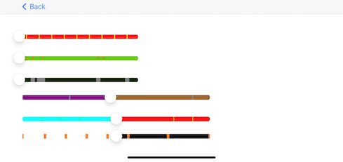

## Commercial

<!-- - **Computer **: 2017 13-inch MacBook Pro, Two Thunderbolt 3 ports
- **External Display**: Dell U2414H
- **Keyboard**: Apple Magic Keyboard
- **Mouse**: Apple Magic Mouse
- **Headphones**: Sennheiser Hd-25 -->
<!-- //- **Editor**: [PhpStorm](https://www.jetbrains.com/es-es/phpstorm/) and [VS Code](https://code.visualstudio.com) with One Dark Theme -->

## Personal Opensource projects

### [SummerPlayerView](https://github.com/superbderrick/SummerPlayerView)

  📺iOS Custom VideoPlayerView for kids, Tried to make it as similar as possible a Youtube kids App Player UI
- **iOS**
- **Swift5**
- **Custom UI**
  
  
  
### [SummerSlider](https://github.com/superbderrick/SummerSlider)

  🍭 SummerSlider that can distinguish the parts where the advertisement of the video player comes out
- **iOS**
- **Swift5**
- **Custom UI**

