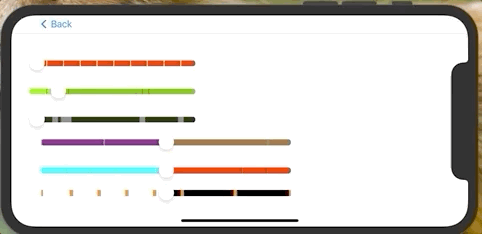

### [SummerSlider](https://github.com/superbderrick/SummerSlider)
  SummerSlider that can distinguish the parts where the advertisement of the video player comes out
- **iOS**
- **Swift5**
- **Custom UI**

